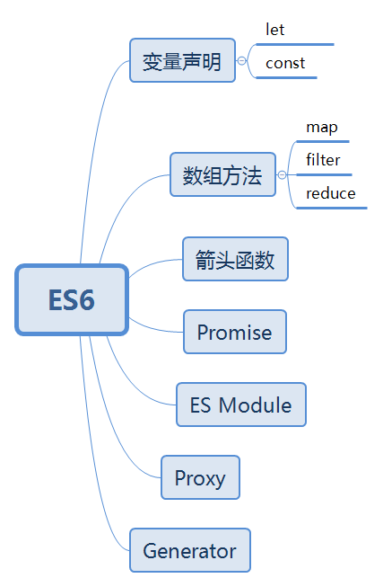

# ES6



### var、let 及 const 区别？
 - 全局申明的var变量会挂载在window上，而let和const不会
 - var声明变量存在变量提升，let和const不会
 - let、const 的作用范围是块级作用域，而var的作用范围是函数作用域
 - 同一作用域下let和const不能声明同名变量，而var可以
 - 同一作用域下在let和const声明前使用会存在暂时性死区
 - const
   - 一旦声明必须赋值,不能使用null占位
   - 声明后不能再修改
   - 如果声明的是复合类型数据，可以修改其属性


### Proxy
 Proxy 是 ES6 中新增的功能，它可以用来自定义对象中的操作。 Vue3.0 中将会通过 Proxy 来替换原本的 Object.defineProperty 来实现数据响应式。
```js
let p = new Proxy(target, handler)
```
`target` 代表需要添加代理的对象，`handler` 用来自定义对象中的操作，比如可以用来自定义 set 或者 get 函数。

```js
let onWatch = (obj, setBind, getLogger) => {
  let handler = {
    set(target, property, value, receiver) {
      setBind(value, property)
      return Reflect.set(target, property, value)
    },
    get(target, property, receiver) {
      getLogger(target, property)
      return Reflect.get(target, property, receiver)
    }
  }
  return new Proxy(obj, handler)
}

let obj = { a: 1 }
let p = onWatch(
  obj,
  (v, property) => {
    console.log(`监听到属性${property}改变为${v}`)
  },
  (target, property) => {
    console.log(`'${property}' = ${target[property]}`)
  }
)
p.a = 2 // 控制台输出：监听到属性a改变
p.a // 'a' = 2
```
自定义 set 和 get 函数的方式，在原本的逻辑中插入了我们的函数逻辑，实现了在对对象任何属性进行读写时发出通知。

当然这是简单版的响应式实现，如果需要实现一个 Vue 中的响应式，需要我们在 get 中收集依赖，在 set 派发更新，之所以 Vue3.0 要使用 Proxy 替换原本的 API 原因在于 Proxy 无需一层层递归为每个属性添加代理，一次即可完成以上操作，性能上更好，并且原本的实现有一些数据更新不能监听到，但是 Proxy 可以完美监听到任何方式的数据改变，唯一缺陷可能就是浏览器的兼容性不好了。


### map
map 作用是生成一个新数组，遍历原数组，将每个元素拿出来做一些变换然后返回一个新数组，原数组不发生改变。

map 的回调函数接受三个参数，分别是当前索引元素，索引，原数组
```js
var arr = [1,2,3];
var arr2 = arr.map(item => item + 1)    
arr   //[ 1, 2, 3 ]
arr2  // [ 2, 3, 4 ]
```

```js
['1','2','3'].map(parseInt)
// -> [ 1, NaN, NaN ]
```
 - 第一个 parseInt('1', 0) -> 1
 - 第二个 parseInt('2', 1) -> NaN
 - 第三个 parseInt('3', 2) -> NaN


### filter
filter 的作用也是生成一个新数组，在遍历数组的时候将返回值为 true 的元素放入新数组，我们可以利用这个函数删除一些不需要的元素

filter 的回调函数接受三个参数，分别是当前索引元素，索引，原数组


### reduce
reduce 可以将数组中的元素通过回调函数最终转换为一个值。
如果我们想实现一个功能将函数里的元素全部相加得到一个值，可能会这样写代码
```js
const arr = [1, 2, 3]
let total = 0
for (let i = 0; i < arr.length; i++) {
  total += arr[i]
}
console.log(total) //6 
```
但是如果我们使用 reduce 的话就可以将遍历部分的代码优化为一行代码
```js
const arr = [1, 2, 3]
const sum = arr.reduce((acc, current) => acc + current, 0)
console.log(sum)
```
对于 reduce 来说，它接受两个参数，分别是回调函数和初始值，接下来我们来分解上述代码中 reduce 的过程
 - 首先初始值为 0，该值会在执行第一次回调函数时作为第一个参数传入
 - 回调函数接受四个参数，分别为累计值、当前元素、当前索引、原数组，后三者想必大家都可以明白作用，这里着重分析第一个参数
 - 在一次执行回调函数时，当前值和初始值相加得出结果 1，该结果会在第二次执行回调函数时当做第一个参数传入
 - 所以在第二次执行回调函数时，相加的值就分别是 1 和 2，以此类推，循环结束后得到结果 6。

### some

对数组中的每个元素都执行一次指定的函数（callback），直到此函数返回 true，如果发现这个元素，some 将返回 true，如果回调函数对每个元素执行后都返回 false ，some 将返回 false。它只对数组中的非空元素执行指定的函数，没有赋值或者已经删除的元素将被忽略。
```js
//检查是否有数组元素大于等于10：

function isBigEnough(element, index, array) {
    return (element >= 10);
}
var passed = [2, 5, 8, 1, 4].some(isBigEnough);
// passed is false
passed = [12, 5, 8, 1, 4].some(isBigEnough);
// passed is true
//结果：
//[2, 5, 8, 1, 4].some(isBigEnough) ： false 
//[12, 5, 8, 1, 4].some(isBigEnough) ： true 
```
### every

对数组中的每个元素都执行一次指定的函数（callback），直到此函数返回 false，如果发现这个元素，every 将返回 false，如果回调函数对每个元素执行后都返回 true ，every 将返回 true。它只对数组中的非空元素执行指定的函数，没有赋值或者已经删除的元素将被忽略

```js

//测试是否所有数组元素都大于等于10：

function isBigEnough(element, index, array) {
    return (element >= 10);
}
var passed = [12, 5, 8, 130, 44].every(isBigEnough);
// passed is false
passed = [12, 54, 18, 130, 44].every(isBigEnough);
// passed is true
//结果：
//[12, 5, 8, 130, 44].every(isBigEnough) 返回 ： false 
//[12, 54, 18, 130, 44].every(isBigEnough) 返回 ： true 
```

### Es6中箭头函数与普通函数的区别？
 - 普通function的声明在变量提升中是最高的，箭头函数没有函数提升
 - 箭头函数没有属于自己的this，arguments
 - 箭头函数不能作为构造函数，不能被new，没有property
 - call和apply方法只有参数，没有作用域


### Promise
`Promise` 翻译过来就是承诺的意思，这个承诺会在未来有一个确切的答复，并且该承诺有三种状态，这个承诺一旦从等待状态变成为其他状态就永远不能更改状态了。

 - 等待中（pending）
 - 完成了（resolved）
 - 拒绝了（rejected）

当我们在构造 Promise 的时候，构造函数内部的代码是立即执行的。
```js
new Promise((resolve, reject) => {
  console.log('new Promise')
  resolve('success')
})
console.log('finifsh')

// 先打印new Promise， 再打印 finifsh
```

Promise 实现了链式调用，也就是说每次调用 then 之后返回的都是一个 Promise，并且是一个全新的 Promise，原因也是因为状态不可变。如果你在 then 中 使用了 return，那么 return 的值会被 Promise.resolve() 包装。
```js
Promise.resolve(1)
  .then(res => {
    console.log(res) // => 1
    return 2 // 包装成 Promise.resolve(2)
  })
  .then(res => {
    console.log(res) // => 2
  })
```

当然了，Promise 也很好地解决了回调地狱的问题
```js
ajax(url)
  .then(res => {
      console.log(res)
      return ajax(url1)
  }).then(res => {
      console.log(res)
      return ajax(url2)
  }).then(res => console.log(res))
```
其实它也是存在一些缺点的，比如无法取消 Promise，错误需要通过回调函数捕获。


### async 和 await

一个函数如果加上 async ，那么该函数就会返回一个 Promise
```js
async function test() {
  return "1"
}
console.log(test()) 
// -> Promise {<resolved>: "1"}
```

async 就是将函数返回值使用 Promise.resolve() 包裹了下，和 then 中处理返回值一样，并且 await 只能配套 async 使用。
```js
async function test() {
  let value = await sleep()
}
```
async 和 await 可以说是异步终极解决方案了，相比直接使用 Promise 来说，优势在于处理 then 的调用链，能够更清晰准确的写出代码，毕竟写一大堆 then 也很恶心，并且也能优雅地解决回调地狱问题。

当然也存在一些缺点，因为 **await 将异步代码改造成了同步代码**，如果多个异步代码没有依赖性却使用了 await 会导致性能上的降低。
```js
async function test() {
  // 以下代码没有依赖性的话，完全可以使用 Promise.all 的方式
  // 如果有依赖性的话，其实就是解决回调地狱的例子了
  await fetch(url)
  await fetch(url1)
  await fetch(url2)
}
```

看一个使用 await 的例子：
```js
let a = 0
let b = async () => {
  a = a + await 10
  console.log('2', a)
}
b()
a++
console.log('1', a)

//先输出  ‘1’, 1
//在输出  ‘2’, 10
```
 - 首先函数 b 先执行，在执行到 await 10 之前变量 a 还是 0，因为 await 内部实现了 generator ，generator 会保留堆栈中东西，所以这时候 a = 0 被保存了下来
 - 因为 await 是异步操作，后来的表达式不返回 Promise 的话，就会包装成 Promise.reslove(返回值)，然后会去执行函数外的同步代码
 - 同步代码 a++ 与打印 a 执行完毕后开始执行异步代码，将保存下来的值拿出来使用，这时候 a = 0 + 10


上述解释中提到了 await 内部实现了 generator，其实 **await 就是 generator 加上 Promise 的语法糖，且内部实现了自动执行 generator**。


### Generator 生成器

```js
function *foo(x) {
  let y = 2 * (yield (x + 1))
  let z = yield (y / 3)
  return (x + y + z)
}
let it = foo(5)
console.log(it.next())   // => {value: 6, done: false}
console.log(it.next(12)) // => {value: 8, done: false}
console.log(it.next(13)) // => {value: 42, done: true}
```

 - 首先 Generator 函数调用和普通函数不同，它会返回一个迭代器

 - 当执行第一次 next 时，传参会被忽略，并且函数暂停在 yield (x + 1) 处，所以返回 5 + 1 = 6

 - 当执行第二次 next 时，传入的参数等于上一个 yield 的返回值，如果你不传参，yield 永远返回 undefined。此时 let y = 2 * 12，所以第二个 yield 等于 2 * 12 / 3 = 8

 - 当执行第三次 next 时，传入的参数会传递给 z，所以 z = 13, x = 5, y = 24，相加等于 42


### 生成器原理

当yeild产生一个值后，生成器的执行上下文就会从栈中弹出。但由于迭代器一直保持着队执行上下文的引用，上下文不会丢失，不会像普通函数一样执行完后上下文就被销毁


### ES Module
ES Module 是原生实现的模块化方案，与 CommonJS 有以下几个区别

 - CommonJS 支持动态导入，也就是 require(${path}/xx.js)，后者目前不支持，但是已有提案
 - CommonJS 是同步导入，因为用于服务端，文件都在本地，同步导入即使卡住主线程影响也不大。而后者是异步导入，因为用于浏览器，需要下载文件，如果也采用同步导入会对渲染有很大影响
 - CommonJS 在导出时都是值拷贝，就算导出的值变了，导入的值也不会改变，所以如果想更新值，必须重新导入一次。但是 ES Module 采用实时绑定的方式，导入导出的值都指向同一个内存地址，所以导入值会跟随导出值变化
 - ES Module 会编译成 require/exports 来执行的

```js
// 引入模块 API
import XXX from './a.js'
import { XXX } from './a.js'
// 导出模块 API
export function a() {}
export default function() {}
```


### 私有方法和私有属性（阿里一面）

[阮老师 | ES6入门](https://es6.ruanyifeng.com/?search=%E7%A7%81%E6%9C%89&x=0&y=0#docs/class#%E7%A7%81%E6%9C%89%E6%96%B9%E6%B3%95%E5%92%8C%E7%A7%81%E6%9C%89%E5%B1%9E%E6%80%A7)


#### 现有的解决方案

私有方法和私有属性，是只能在类的内部访问的方法和属性，外部不能访问。这是常见需求，有利于代码的封装，但 ES6 不提供，只能通过变通方法模拟实现。

一种做法是在命名上加以区别，即在函数名或属性名前加`_`，但这并不安全，只是一种团队规范。

另一种方法就是索性**将私有方法移出类，放到模块里**，因为模块内部的所有方法都是对外可见的。
```js
class Widget {
  foo (baz) {
    bar.call(this, baz);
  }

  // ...
}

function bar(baz) {
  return this.snaf = baz;
}
```
上面代码中，foo是公开方法，内部调用了bar.call(this, baz)。这使得bar实际上成为了当前模块的私有方法。


还有一种方法是利用**Symbol值的唯一性**，将私有方法的名字命名为一个Symbol值。
```js
const bar = Symbol('bar');
const snaf = Symbol('snaf');

export default class myClass{

  // 公有方法
  foo(baz) {
    this[bar](baz);
  }

  // 私有方法
  [bar](baz) {
    return this[snaf] = baz;
  }

  // ...
};
```

上面代码中，bar和snaf都是Symbol值，一般情况下无法获取到它们，因此达到了私有方法和私有属性的效果。但是也不是绝对不行，Reflect.ownKeys()依然可以拿到它们。

```js
const inst = new myClass();

Reflect.ownKeys(myClass.prototype)
// [ 'constructor', 'foo', Symbol(bar) ]
```

### Set 

 `new Set([iterable]);`

Set 对象允许你存储任何类型的唯一值，无论是原始值或者是对象引用。

**属性:**

`Set.length`
length属性的值为0。
`get Set[@@species]`
构造函数用来创建派生对象.
`Set.prototype`
表示Set构造器的原型，允许向所有Set对象添加新的属性。

**Set实例**

所有Set实例继承自 Set.prototype。

**属性:**

`Set.prototype.constructor`
返回实例的构造函数。默认情况下是Set。

`Set.prototype.size`
返回Set对象的值的个数。

**方法:**

`Set.prototype.add(value)`
在Set对象尾部添加一个元素。返回该Set对象。

`Set.prototype.clear()`
移除Set对象内的所有元素。

`Set.prototype.delete(value)`
移除Set的中与这个值相等的元素，返回Set.prototype.has(value)在这个操作前会返回的值（即如果该元素存在，返回true，否则返回false）。Set.prototype.has(value)在此后会返回false。

`Set.prototype.entries()`
返回一个新的迭代器对象，该对象包含Set对象中的按插入顺序排列的所有元素的值的[value, value]数组。为了使这个方法和Map对象保持相似， 每个值的键和值相等。

`Set.prototype.forEach(callbackFn[, thisArg])`
按照插入顺序，为Set对象中的每一个值调用一次callBackFn。如果提供了thisArg参数，回调中的this会是这个参数。

`Set.prototype.has(value)`
返回一个布尔值，表示该值在Set中存在与否。

`Set.prototype.keys()`
与values()方法相同，返回一个新的迭代器对象，该对象包含Set对象中的按插入顺序排列的所有元素的值。

`Set.prototype.values()`
返回一个新的迭代器对象，该对象包含Set对象中的按插入顺序排列的所有元素的值。

`Set.prototype[@@iterator]()`
返回一个新的迭代器对象，该对象包含Set对象中的按插入顺序排列的所有元素的值。

**示例**
```js
let mySet = new Set();

mySet.add(1); // Set(1) {1}
mySet.add(5); // Set(2) {1, 5}
mySet.add(5); // Set { 1, 5 }
mySet.add("some text"); // Set(3) {1, 5, "some text"}
var o = {a: 1, b: 2};
mySet.add(o);

mySet.add({a: 1, b: 2}); // o 指向的是不同的对象，所以没问题

mySet.has(1); // true
mySet.has(3); // false
mySet.has(5);              // true
mySet.has(Math.sqrt(25));  // true
mySet.has("Some Text".toLowerCase()); // true
mySet.has(o); // true

mySet.size; // 5

mySet.delete(5);  // true,  从set中移除5
mySet.has(5);     // false, 5已经被移除

mySet.size; // 4, 刚刚移除一个值
console.log(mySet); // Set {1, "some text", Object {a: 1, b: 2}, Object {a: 1, b: 2}}
```

### Map 

`new Map([iterable])`

Map 对象保存键值对。任何值(对象或者原始值) 都可以作为一个键或一个值。

Objects 和 maps 的比较:
- 一个Object的键只能是字符串或者 Symbols，但一个 Map 的键可以是任意值，包括函数、对象、基本类型。
- Map 中的键值是有序的，而添加到对象中的键则不是。因此，当对它进行遍历时，Map 对象是按插入的顺序返回键值。
- 你可以通过 size 属性直接获取一个 Map 的键值对个数，而 Object 的键值对个数只能手动计算。
- Map 可直接进行迭代，而 Object 的迭代需要先获取它的键数组，然后再进行迭代。
- Object 都有自己的原型，原型链上的键名有可能和你自己在对象上的设置的键名产生冲突。虽然 ES5 开始可以用 map = Object.create(null) 来创建一个没有原型的对象，但是这种用法不太常见。
- Map 在涉及频繁增删键值对的场景下会有些性能优势。

**属性:**

`Map.length`
属性 length 的值为 0 。

`get Map[@@species]`
本构造函数用于创建派生对象。

`Map.prototype`
表示 Map 构造器的原型。 允许添加属性从而应用于所有的 Map 对象。

**Map实例**

所有的 Map 对象实例都会继承 Map.prototype。

**属性:**

`Map.prototype.constructor`
返回一个函数，它创建了实例的原型。默认是Map函数。

`Map.prototype.size`
返回Map对象的键/值对的数量。

**方法:**
`Map.prototype.clear()`
移除Map对象的所有键/值对。

`Map.prototype.delete(key)`
如果 Map 对象中存在该元素，则移除它并返回 true；否则如果该元素不存在则返回 false

`Map.prototype.entries()`
返回一个新的 Iterator 对象，它按插入顺序包含了Map对象中每个元素的 [key, value] 数组。

`Map.prototype.forEach(callbackFn[, thisArg])`
按插入顺序，为 Map对象里的每一键值对调用一次callbackFn函数。如果为forEach提供了thisArg，它将在每次回调中作为this值。

`Map.prototype.get(key)`
返回键对应的值，如果不存在，则返回undefined。

`Map.prototype.has(key)`
返回一个布尔值，表示Map实例是否包含键对应的值。

`Map.prototype.keys()`
返回一个新的 Iterator对象， 它按插入顺序包含了Map对象中每个元素的键 。

`Map.prototype.set(key, value)`
设置Map对象中键的值。返回该Map对象。

`Map.prototype.values()`
返回一个新的Iterator对象，它按插入顺序包含了Map对象中每个元素的值。

`Map.prototype[@@iterator]()`
返回一个新的Iterator对象，它按插入顺序包含了Map对象中每个元素的 [key, value] 数组。

**示例**

```js
var myMap = new Map();
 
var keyObj = {},
    keyFunc = function () {},
    keyString = "a string";
 
// 添加键
myMap.set(keyString, "和键'a string'关联的值");
myMap.set(keyObj, "和键keyObj关联的值");
myMap.set(keyFunc, "和键keyFunc关联的值");
 
myMap.size; // 3
 
// 读取值
myMap.get(keyString);    // "和键'a string'关联的值"
myMap.get(keyObj);       // "和键keyObj关联的值"
myMap.get(keyFunc);      // "和键keyFunc关联的值"
 
myMap.get("a string");   // "和键'a string'关联的值"
                         // 因为keyString === 'a string'
myMap.get({});           // undefined, 因为keyObj !== {}
myMap.get(function() {}) // undefined, 因为keyFunc !== function () {}
```

### Symbol 

Symbol() 函数会返回 symbol 类型的值，该类型具有静态属性和静态方法。它的静态属性会暴露几个内建的成员对象；它的静态方法会暴露全局的 symbol 注册，且类似于内建对象类，但作为构造函数来说它并不完整，因为它不支持语法："new Symbol()"。所以使用 Symbol 生成的值是不相等：

```js
const s1 = Symbol();
const s2 = Symbol();
console.log(s1 === s2); // false
```

实例化 symbol 时，有一个可选的第一个参数，你可以选择为其提供字符串。 此值旨在用于调试代码，否则它不会真正影响symbol 本身。

```js
const s1 = Symbol("debug");
const str = "debug";
const s2 = Symbol("xxyy");
console.log(s1 === str); // false
console.log(s1 === s2); // false
console.log(s1); // Symbol(debug)
```

#### symbol 作为对象属性

symbol 还有另一个重要的用途,它们可以用作对象中的键，如下：

```js
const obj = {};
const sym = Symbol();
obj[sym] = "foo";
obj.bar = "bar";
console.log(obj); // { bar: 'bar' }
console.log(sym in obj); // true
console.log(obj[sym]); // foo
console.log(Object.keys(obj)); // ['bar']
```

乍一看，这看起来就像可以使用 symbol 在对象上创建私有属性，许多其他编程语言在其类中有自己的私有属性，私有属性遗漏一直被视为 JavaScript 的缺点。

不幸的是，与该对象交互的代码仍然可以访问其键为 symbol 的属性。 在调用代码尚不能访问 symbol 本身的情况下，这甚至是可能的。 例如，Reflect.ownKeys() 方法能够获取对象上所有键的列表，包括字符串和 symbol ：

```js
function tryToAddPrivate(o) {
    o[Symbol("Pseudo Private")] = 42;
}
const obj = { prop: "hello" };
tryToAddPrivate(obj);
console.log(Reflect.ownKeys(obj));
// [ 'prop', Symbol(Pseudo Private) ]
console.log(obj[Reflect.ownKeys(obj)[1]]); // 42
```

#### 防止属性名称冲突

符号可能不会直接受益于 JavaScript 为对象提供私有属性。然而，他们是有益的另一个原因。当不同的库希望向对象添加属性而不存在名称冲突的风险时，它们非常有用。

Symbol 为 JavaScrit 对象提供私有属性还有点困难，但 Symbol 还有别外一个好处，就是避免当不同的库向对象添加属性存在命名冲突的风险。

考虑这样一种情况:两个不同的库想要向一个对象添加基本数据，可能它们都想在对象上设置某种标识符。通过简单地使用 id 作为键，这样存在一个巨大的风险，就是多个库将使用相同的键。

```js
function lib1tag(obj) {
    obj.id = 42;
}
function lib2tag(obj) {
    obj.id = 369;
}
```

通过使用 Symbol，每个库可以在实例化时生成所需的 Symbol。然后用生成 Symbol 的值做为对象的属性：

```js
const library1property = Symbol("lib1");
function lib1tag(obj) {
    obj[library1property] = 42;
}
const library2property = Symbol("lib2");
function lib2tag(obj) {
    obj[library2property] = 369;
}
```

出于这个原因，Symbol 似乎确实有利于 JavaScript。

JavaScript 为什么要有 Symbol 类型:
https://segmentfault.com/a/1190000018522663