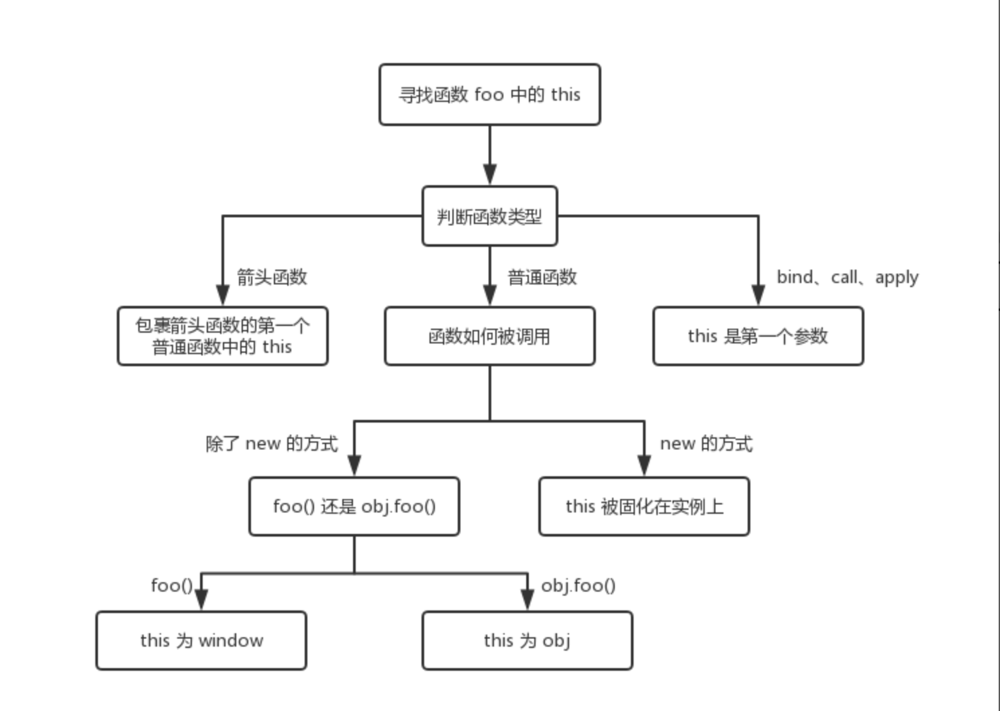

# JS基础

### onLoad和DomContentLoad的区别

- onLoad是的在页面所有文件加载完成后执行。
- DomContentLoad是Dom加载完成后执行，不必等待样式脚本和图片加载。

>原理：如果是webkit引擎则轮询document的readyState属性，当值为loaded或者complete时则触发DOMContentLoaded事件，对webkit525之后版本直接可以注册DOMContentLoaded事件

document.readyState 属性返回当前文档的状态:
- uninitialized - 还未开始载入
- loading - 载入中
- interactive - 已加载，文档与用户可以开始交互   
- complete - 载入完成

### this



### 如何判断对象是否相等？

简单方法：

```js
var a = {
    name:10,
    age:20
}
var b = {
    name:10,
    age:20
}
a = JSON.stringify(a)
b = JSON.stringify(b)
a === b //true
```

专业方法：

```js
        function diff(obj1, obj2) {
            var o1 = obj1 instanceof Object;
            var o2 = obj2 instanceof Object;
            if (!o1 || !o2) {/*  判断不是对象  */
                return obj1 === obj2;
            }

            if (Object.keys(obj1).length !== Object.keys(obj2).length) {
                return false;
                //Object.keys() 返回一个由对象的自身可枚举属性(key值)组成的数组,例如：数组返回下表：let arr = ["a", "b", "c"];console.log(Object.keys(arr))->0,1,2;
            }

            for (var attr in obj1) {
                var t1 = obj1[attr] instanceof Object;
                var t2 = obj2[attr] instanceof Object;
                if (t1 && t2) {
                    return diff(obj1[attr], obj2[attr]);
                } else if (obj1[attr] !== obj2[attr]) {
                    return false;
                }
            }
            return true;
        }

        console.log(diff(a, b));
```

### 对象（Object）和字符串（String）互转

利用原生JSON对象，将对象转为字符串:

```js
var obj = {
    a:123
}
var str = JSON.stringify(obj);  
```

从JSON字符串转为对象:

```js
var newObj = JSON.parse(str);  
```

### 如何定时请求数据?

实现实时通信,我们通常有三种方法:
- ajax轮询

ajax轮询的原理非常简单,让浏览器每隔几秒就像服务器发送一个请求,询问服务器是否有新的信息.

- http 长轮询

长轮询的机制和ajax轮询差不多,都是采用轮询的方式,不过才去的是阻塞模型(一直打电话,没收到就不挂电话),也就是说,客户端发起链接后,如果没有消息,就一直不返回response给客户端.知道有新的消息才返回,返回完之后,客户端再此建立连接,周而复始.

- WebSocket

WebSocket是HTML5开始提供的一种在单个TCP连接上进行全双工通讯的协议.在WebSocket API中，浏览器和服务器只需要做一个握手的动作，然后，浏览器和服务器之间就形成了一条快速通道。两者之间就直接可以数据互相传送,不需要繁琐的询问和等待.
从上面的介绍很容易看出来,ajax轮询和长轮询都是非常耗费资源的,ajax轮询需要服务器有很快的处理速度和资源,http长轮询需要有很高的并发,也就是同时接待客户的能力.而WebSocket,只需要经过一次HTTP请求,就可以与服务端进行源源不断的消息收发了.

\