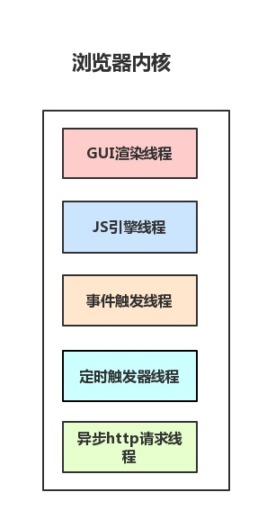
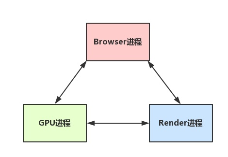

### 浏览器
#### 进程和线程
- 进程是cpu资源分配的最小单位（是能拥有资源和独立运行的最小单位）
- 线程是cpu调度的最小单位（线程是建立在进程的基础上的一次程序运行单位，一个进程中可以有多个线程）
- 不同进程之间也可以通信，不过代价较大
- 现在，一般通用的叫法：单线程与多线程，都是指在一个进程内的单和多。（所以核心还是得属于一个进程才行）

#### 浏览器都包含哪些进程？
- Browser进程
浏览器的主进程（负责协调、主控），只有一个。作用有负责浏览器界面显示，与用户交互。如前进，后退等负责各个页面的管理，创建和销毁其他进程将Renderer进程得到的内存中的Bitmap，绘制到用户界面上网络资源的管理，下载等第
- 三方插件进程
每种类型的插件对应一个进程，仅当使用该插件时才创建
- GPU进程
最多一个，用于3D绘制等。
- 浏览器渲染进程（浏览器内核）（Renderer进程，内部是多线程的）
默认每个Tab页面一个进程，互不影响。主要作用为页面渲染，脚本执行，事件处理等。

      在浏览器中打开一个网页相当于新起了一个进程（进程内有自己的多线程）

#### 浏览器内核（渲染进程）包含哪些线程？   

##### GUI渲染线程
- 负责渲染浏览器界面，解析HTML，CSS，构建DOM树和RenderObject树，布局和绘制等。
- 当界面需要重绘（Repaint）或由于某种操作引发回流(reflow)时，该线程就会执行
- 注意，GUI渲染线程与**JS引擎线程是互斥的**，当JS引擎执行时GUI线程会被挂起（相当于被冻结了），GUI更新会被保存在一个队列中**等到JS引擎空闲时**立即被执行。
##### JS引擎线程
- 也称为JS内核，负责处理Javascript脚本程序。（例如V8引擎）
- JS引擎线程负责解析Javascript脚本，运行代码。
- JS引擎一直等待着任务队列中任务的到来，然后加以处理，一个Tab页（renderer进程）中无论什么时候都只有一个JS线程在运行JS程序
- 同样注意，GUI渲染线程与JS引擎线程是互斥的，所以如果JS执行的时间过长，这样就会造成页面的渲染不连贯，导致页面渲染加载阻塞。
##### 事件触发线程
- 归属于浏览器而不是JS引擎，用来控制事件循环（可以理解，JS引擎自己都忙不过来，需要浏览器另开线程协助）
- 当JS引擎执行代码块如setTimeOut时（也可来自浏览器内核的其他线程,如鼠标点击、AJAX异步请求等），会将对应任务添加到事件线程中
- 当对应的事件符合触发条件被触发时，该线程会把事件添加到待处理队列的队尾，等待JS引擎的处理
- 注意，由于JS的单线程关系，所以这些待处理队列中的事件都得排队等待JS引擎处理（当JS引擎空闲时才会去执行）
##### 定时触发器线程
- 传说中的setInterval与setTimeout所在线程
- 浏览器定时计数器并不是由JavaScript引擎计数的,（因为JavaScript引擎是单线程的, 如果处于阻塞线程状态就会影响记计时的准确）
- 因此通过单独线程来计时并触发定时（计时完毕后，添加到事件队列中，等待JS引擎空闲后执行）
- 注意，W3C在HTML标准中规定，规定要求setTimeout中低于4ms的时间间隔算为4ms。
##### 异步http请求线程
- 在XMLHttpRequest在连接后是通过浏览器新开一个线程请求
- 将检测到状态变更时，如果设置有回调函数，异步线程就产生状态变更事件，将这个回调再放入事件队列中。再由JavaScript引擎执行。

### Browser进程和浏览器内核（Renderer进程）的通信过程

### GUI渲染线程与JS引擎线程互斥

由于JavaScript是可操纵DOM的，如果在修改这些元素属性同时渲染界面（即JS线程和UI线程同时运行），那么渲染线程前后获得的元素数据就可能不一致了。因此为了防止渲染出现不可预期的结果，浏览器设置GUI渲染线程与JS引擎为互斥的关系，当JS引擎执行时GUI线程会被挂起，GUI更新则会被保存在一个队列中等到JS引擎线程空闲时立即被执行。

### JS阻塞页面加载

从上述的互斥关系，可以推导出，JS如果执行时间过长就会阻塞页面。譬如，假设JS引擎正在进行巨量的计算，此时就算GUI有更新，也会被保存到队列中，等待JS引擎空闲后执行。然后，由于巨量计算，所以JS引擎很可能很久很久后才能空闲，自然会感觉到巨卡无比。所以，要尽量避免JS执行时间过长，这样就会造成页面的渲染不连贯，导致页面渲染加载阻塞的感觉。

### 简单梳理下浏览器渲染流程

1.解析html建立dom树
2.解析css构建render树（将CSS代码解析成树形的数据结构，然后结合DOM合并成render树）
3.布局render树（Layout/reflow），负责各元素尺寸、位置的计算
4.绘制render树（paint），绘制页面像素信息
5.浏览器会将各层的信息发送给GPU，GPU会将各层合成（composite），显示在屏幕上。

### load事件与DOMContentLoaded事件的先后

- 当 DOMContentLoaded 事件触发时，仅当DOM加载完成，不包括样式表，图片。(譬如如果有async加载的脚本就不一定完成)
- 当 onload 事件触发时，页面上所有的DOM，样式表，脚本，图片都已经加载完成了。（渲染完毕了）

所以，顺序是：`DOMContentLoader -> load`

### css加载是否会阻塞dom树渲染？

这里说的是头部引入css的情况

首先，我们都知道：**css是由单独的下载线程异步下载的。**
- css加载不会阻塞DOM树解析（异步加载时DOM照常构建）
- 但会阻塞render树渲染（渲染时需等css加载完毕，因为render树需要css信息）
