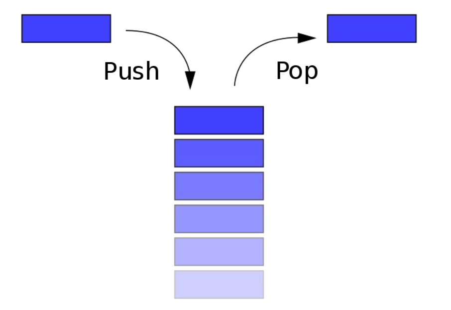
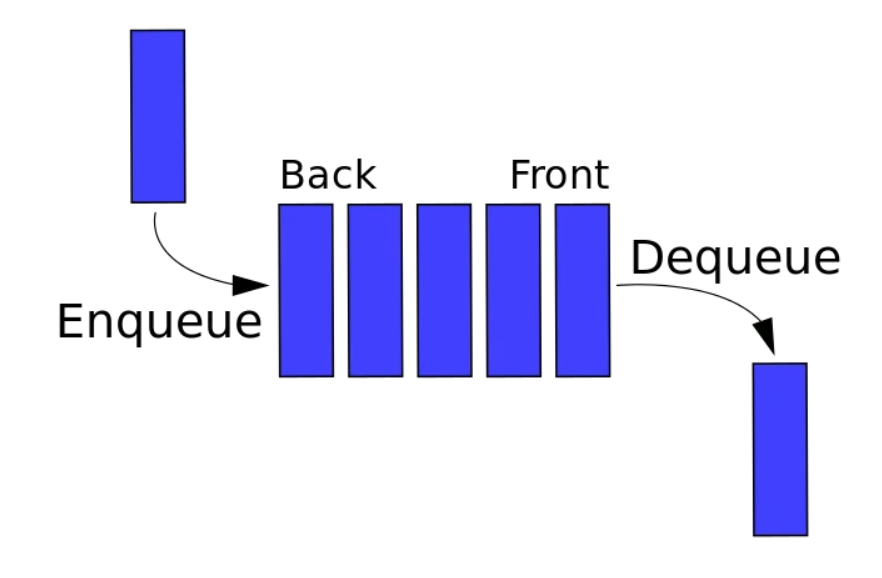
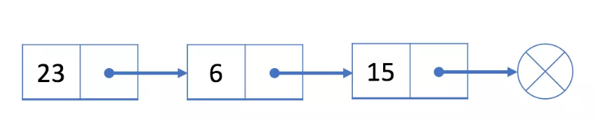

# 数据结构

### 栈

栈是一个线性结构，在计算机中是一个相当常见的数据结构。

栈的特点是只能在某一端添加或删除数据，遵循先进后出的原则。

### 队列

队列是一个线性结构，特点是在某一端添加数据，在另一端删除数据，遵循先进先出的原则。

### 链表

链表是一个线性结构，同时也是一个天然的递归结构。链表结构可以充分利用计算机内存空间，实现灵活的内存动态管理。但是链表失去了数组随机读取的优点，同时链表由于增加了结点的指针域，空间开销比较大。

