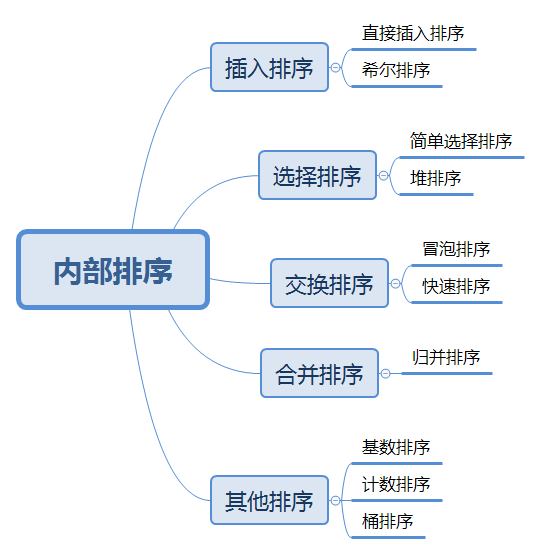

# 算法



**通用函数**

```js
function swap(arr,left,right){
    let rightValue = arr[right];
    arr[right] = arr[left];
    arr[left] = rightValue;
}
```


### 快速排序 

**O(nlogn)**

```js
function quickSort(arr){
    if(arr.length <= 1){
        return arr
    }
    var pivotIndex = Math.floor(arr.length/2);
    var pivot = arr.splice(pivotIndex,1)[0];
    var left = [];
    var right = [];
    for(var i=0;i<arr.length;i++){
        if(arr[i]<pivot){
            left.push[arr[i]]
        }else{
            right.push[arr[i]]
        }
    }
    return quickSort(left).concat([pivot],quickSort(right))
}
```


### 冒泡排序

**O(n^2)**

```js
function bubbleSort(arr){
  for(let i=arr.length-1;i>0;i--){
      for(let j=0;j<i;j++){
          if(arr[j]>arr[j+1]){
              swap(arr,j,j+1)
          }
      }
  }
  return arr
}
```


